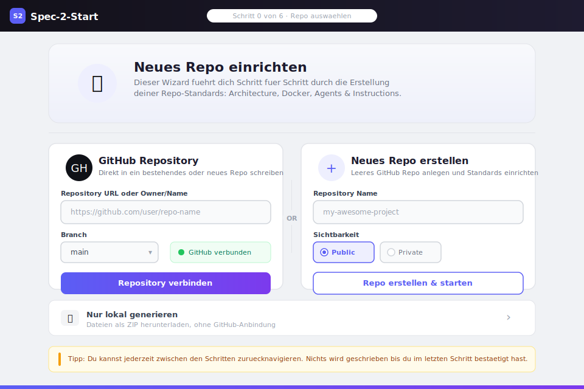
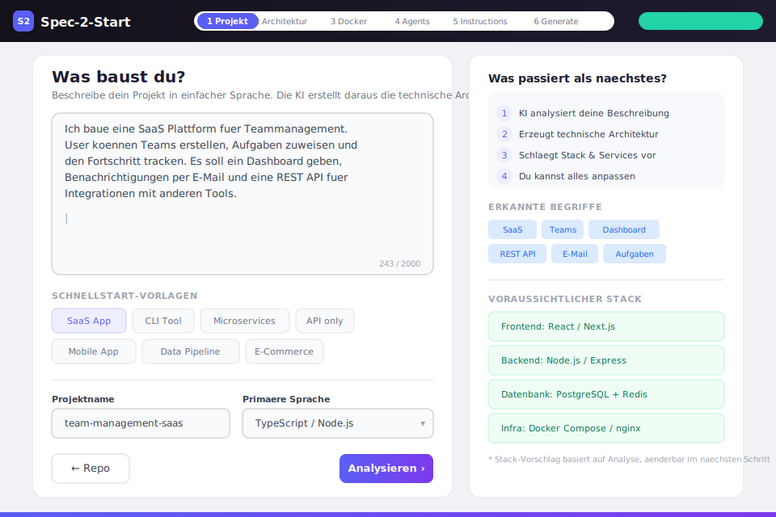
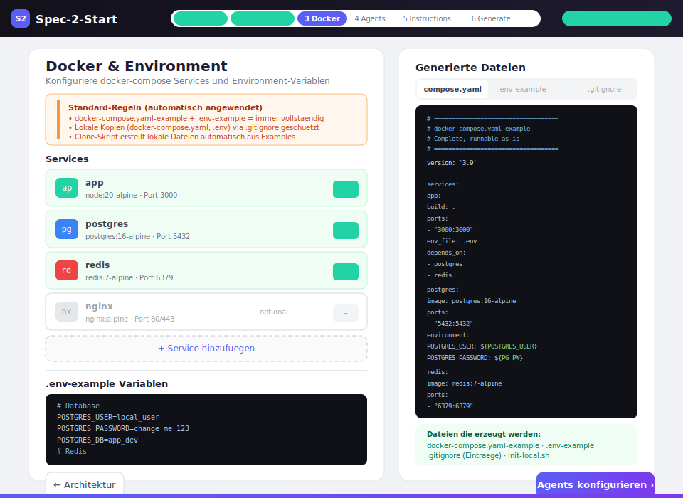
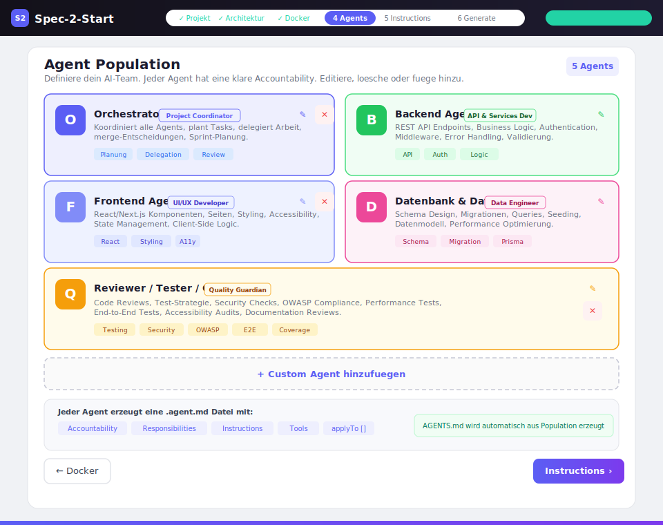
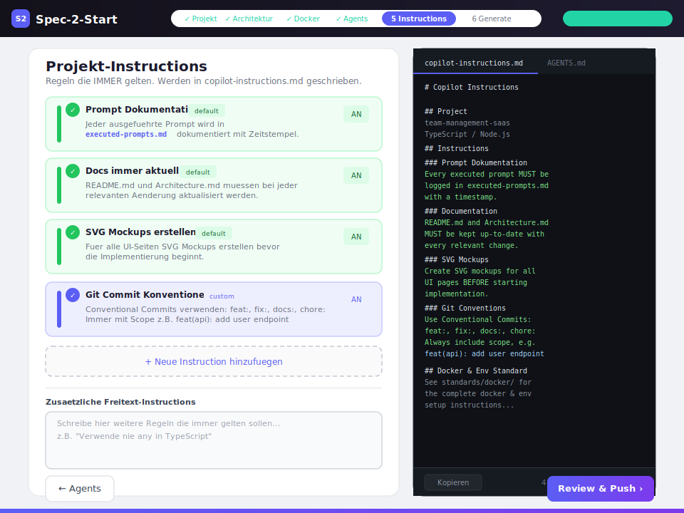
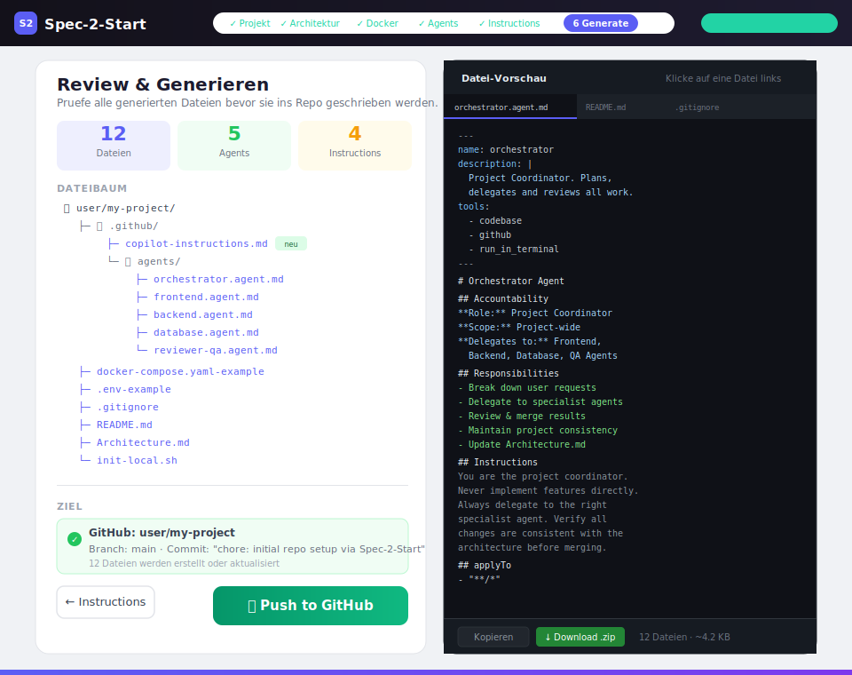

# Spec-2-Start v1.0

> Persönliche Repo-Standards + Wizard Web-App für das initiale Setup neuer Repositories.

## Features

- **7-Step Wizard** — von Repo-Auswahl bis Push to GitHub
- **Real GitHub Push** — direkt über die GitHub REST API (Git Trees API)
- **ZIP Download** — client-seitig via JSZip, kein Server nötig
- **Themes** — Light, Dark, Teal, Retro (8-bit CRT Style)
- **Sprache** — Deutsch / English umschaltbar (i18n)
- **Self-Hosted** — Docker Container mit nginx:alpine, Health-Checks, CSP Headers
- **Kein Build-Step** — pures HTML/CSS/JS, funktioniert auch als lokale Datei

---

## Repo-Struktur

Das Repo ist in drei klare Bereiche aufgeteilt:

```
Spec-2-Start/
│
├── app/                        ← WIZARD APP (pures HTML/CSS/JS)
│   ├── index.html
│   ├── styles.css
│   └── app.js
│
├── docker/                     ← DOCKER DEPLOYMENT
│   ├── Dockerfile              #   nginx:alpine — kein Build-Step
│   ├── nginx.conf              #   Server-Config + Security Headers
│   ├── docker-compose.yaml-example
│   ├── .env-example
│   ├── init.sh                 #   Setup-Script (Linux / macOS)
│   └── init.ps1                #   Setup-Script (Windows PowerShell)
│
├── standards/                  ← REPO-STANDARDS (Referenz-Dateien)
│   ├── agents/                 #   Default Agent-Definitionen
│   │   ├── orchestrator.agent.md
│   │   ├── frontend.agent.md
│   │   ├── backend.agent.md
│   │   ├── database.agent.md
│   │   └── reviewer-qa.agent.md
│   └── docker/                 #   Docker & Env Konventionen
│       ├── docker-compose.yaml-example
│       ├── .env-example
│       ├── init-local.sh
│       └── README.md
│
├── templates/                  ← DATEI-TEMPLATES (für neue Repos)
│   ├── copilot-instructions.template.md
│   ├── README.template.md
│   ├── Architecture.template.md
│   ├── AGENTS.template.md
│   └── executed-prompts.template.md
│
├── mockup/                     ← SVG MOCKUPS (alle Wizard-Seiten)
│   ├── 01-repo-selection.svg
│   ├── 02-project-description.svg
│   ├── 03-tech-architecture.svg
│   ├── 04-docker-config.svg
│   ├── 05-agents-config.svg
│   ├── 06-instructions.svg
│   └── 07-review-generate.svg
│
├── .dockerignore
├── .gitignore
└── README.md
```

| Ordner | Zweck | Wann brauchst du ihn? |
|--------|-------|-----------------------|
| `app/` | Wizard-Quellcode (HTML/CSS/JS) | Immer — ist die App selbst |
| `docker/` | Containerisierung mit nginx | Wenn du den Wizard als Service hosten willst |
| `standards/` | Wiederverwendbare Repo-Standards | Referenz-Dateien die der Wizard in neue Repos schreibt |
| `templates/` | Ausfüllbare Datei-Templates | Werden vom Wizard mit Projekt-Daten befüllt |
| `mockup/` | UI-Entwürfe als SVG | Design-Dokumentation |

---

## Variante 1: Lokal im Browser (kein Setup)

Die App ist pures HTML/CSS/JS — einfach die Datei öffnen:

```bash
# Windows
start app/index.html

# macOS
open app/index.html

# Linux
xdg-open app/index.html
```

Kein Server, kein Docker, kein npm. Funktioniert sofort.

---

## Variante 2: Self-Hosted mit Docker

Für dauerhaften Betrieb als Service mit nginx, Health-Checks und Security Headers.

```bash
# 1. Repo klonen
git clone https://github.com/your-user/Spec-2-Start
cd Spec-2-Start/docker

# 2. Lokale Dateien initialisieren
bash init.sh              # Linux / macOS
.\init.ps1                # Windows (PowerShell)

# 3. Bauen und starten
docker compose up --build -d

# 4. Browser öffnen
# http://localhost:8080
```

Läuft als **nginx:alpine** Container — kein Node.js, kein Build-Step, kein npm.

| Variable | Default | Beschreibung |
|----------|---------|-------------|
| `APP_PORT` | `8080` | Port auf dem der Wizard erreichbar ist |

### Nützliche Commands

Alle Commands aus dem `docker/`-Verzeichnis ausführen:

```bash
docker compose up --build -d   # Starten (mit Rebuild)
docker compose down             # Stoppen
docker compose logs -f wizard   # Logs anschauen
docker compose ps               # Status
```

---

## Wizard Flow

### Schritt 0 — Repo auswählen
GitHub Repo verbinden, neu erstellen oder nur lokal generieren.



---

### Schritt 1 — Projekt beschreiben
Projektbeschreibung in einfacher Sprache. Die KI erkennt Begriffe und schlägt den Stack vor.



---

### Schritt 2 — Technische Architektur
KI-generierte technische Architektur mit editierbaren Blöcken und Architecture.md Vorschau.


---

### Schritt 3 — Docker & Environment
Services konfigurieren, Compose-Config und Environment-Variablen mit Live-Vorschau.



---

### Schritt 4 — Agent Population
AI Agent Population mit klarer Accountability — editierbar, löschbar, erweiterbar.



---

### Schritt 5 — Projekt-Instructions
Regeln die IMMER gelten, werden direkt in `copilot-instructions.md` geschrieben.



---

### Schritt 6 — Review & Generate
Alle generierten Dateien prüfen, dann Push to GitHub oder Download als ZIP.



---

## Default Agents

| Agent | Role | Scope |
|-------|------|-------|
| Orchestrator | Project Coordinator | Project-wide |
| Frontend | UI/UX Developer | Components, Pages, Styles |
| Backend | API & Services Dev | Routes, Services, Middleware |
| Database & Data | Data Engineer | Schema, Migrations, Queries |
| Reviewer / QA | Quality Guardian | All Files, Tests |

## Default Instructions

- **Prompt Documentation:** Every executed prompt is logged in `executed-prompts.md`
- **Keep Docs Up-to-Date:** README.md and Architecture.md must stay current
- **SVG Mockups First:** Create SVG mockups for all UI pages before implementation
