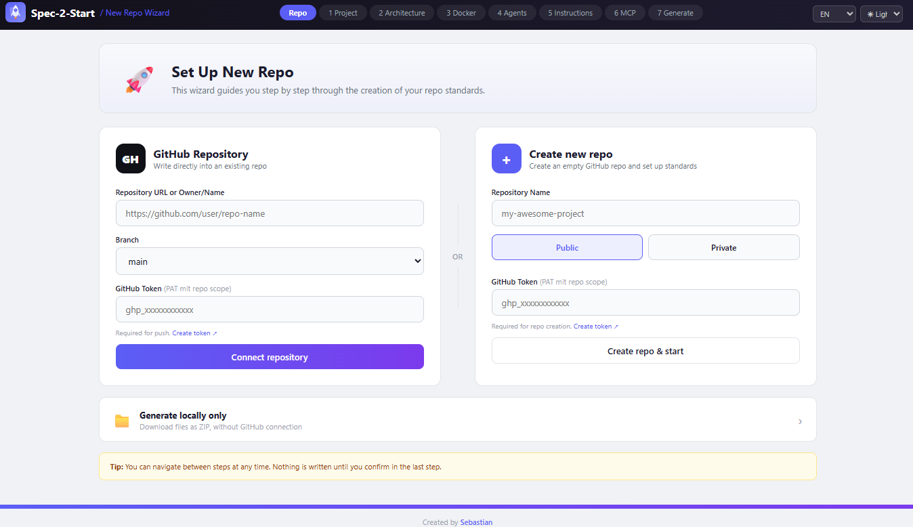
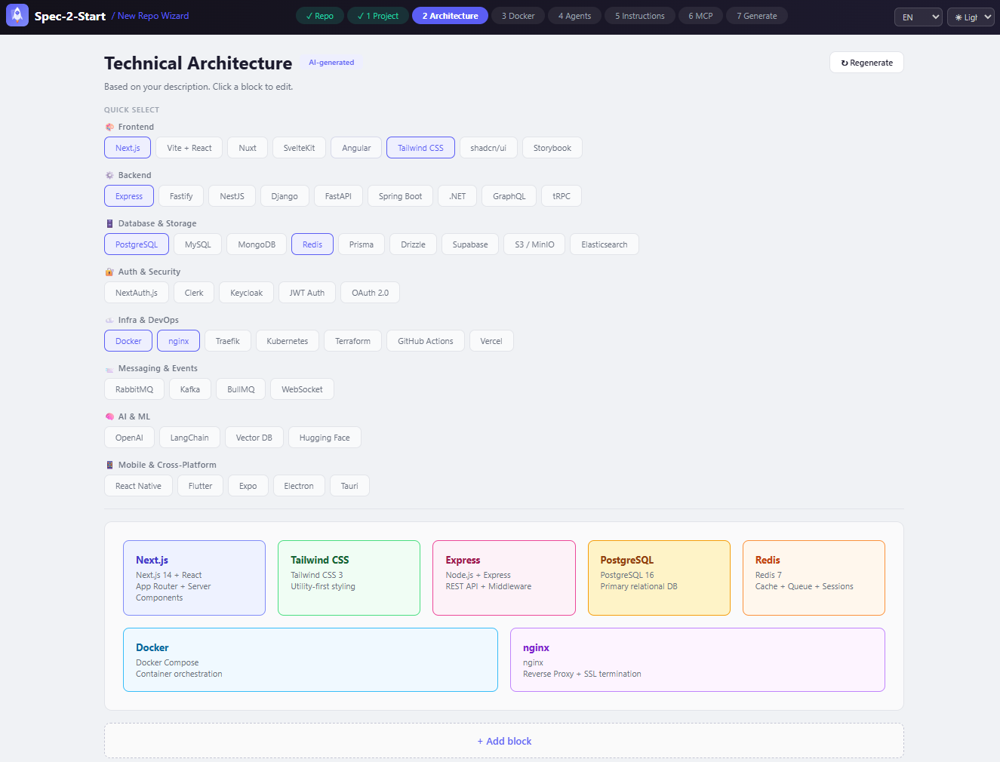
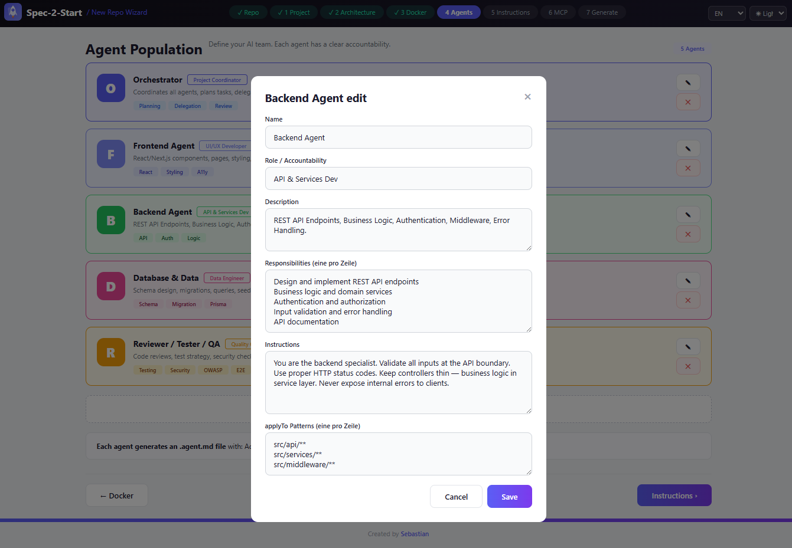
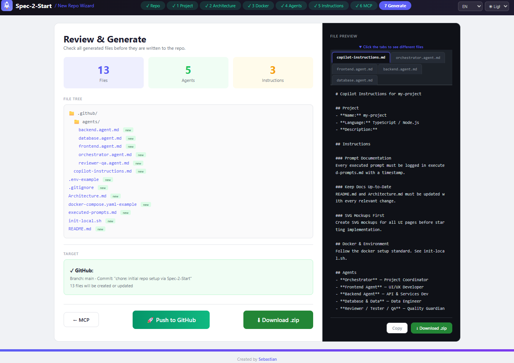

-----

# 🚀 Spec-2-Start: The Ultimate AI-Native Dev Environment Wizard

**Stop wasting hours on boilerplate and environment configuration. Start building with a world-class AI architecture in seconds.**

`Spec-2-Start` is a lightweight, high-performance scaffolding engine designed to bridge the gap between a raw idea ("Spec") and a production-ready repository ("Start"). It provides a **Top-Tier AI Setup** including standardized instructions, scalable architecture, and MCP (Model Context Protocol) agent markdowns.

-----

## 🔥 Why Spec-2-Start?

In the era of AI-assisted coding (Cursor, Claude, GPT-4), your repository structure is your competitive advantage. `Spec-2-Start` pre-configures your environment so that both you and your AI agents can work with maximum context and zero friction.

### 🌟 Key Highlights

  * **Wizard-Driven Setup:** A pure HTML/JS interface that walks you through repo selection, tech architecture, and agent configuration.
  * **AI-Ready Architecture:** Pre-defined folder structures optimized for LLM context windows.
  * **MCP Agent Integration:** Built-in Markdown templates for orchestrators, frontend, backend, and QA agents.
  * **Zero Dependencies:** No `npm install`, no `node_modules` clutter. Just pure, fast, and efficient logic.
  * **Standardized Instructions:** System prompts and `.cursorrules` templates that make your AI significantly smarter.

-----

## 📸 The Wizard Interface

| Step | Focus | Description |
| :--- | :--- | :--- |
| **01** | Repo Selection | Define your project name and core path. |

| **02** | Description | High-level project goal and scope. |
| **03** | Architecture | Define your tech stack (Next.js, FastAPI, etc.). |

| **04** | Docker | Auto-generate your container configurations. |
| **05** | AI Agents | Configure your specialized AI workforce. |



-----

## 🚀 Quick Start

You can run the Wizard in two ways. Both are extremely lightweight and require **no build steps**.

### Option 1: Local (Zero Setup)

The app is pure HTML/CSS/JS. Just open the file and you are ready to go.

  * **Windows:** `start app/index.html`
  * **macOS:** `open app/index.html`
  * **Linux:** `xdg-open app/index.html`

> [\!TIP]
> No server, no Docker, no npm. It works instantly in your favorite browser.

-----

### Option 2: Self-Hosted with Docker

Ideal for permanent deployment as a team service with Nginx, health checks, and security headers.

1.  **Clone & Navigate:**
    ```bash
    git clone https://github.com/thesebastianf/spec-2-start
    cd spec-2-start/docker
    ```
2.  **Initialize local files:**
    ```bash
    bash init.sh              # Linux / macOS
    .\init.ps1                # Windows (PowerShell)
    ```
3.  **Launch:**
    ```bash
    docker compose up --build -d
    ```
4.  **Open Browser:** `http://localhost:8080`

**Environment Variables:**
| Variable | Default | Description |
| :--- | :--- | :--- |
| `APP_PORT` | `8080` | Port where the Wizard is reachable. |

-----

## 📂 Project Structure

```text
Spec-2-Start/
├── app/                # WIZARD APP (Pure HTML/CSS/JS)
├── docker/             # DOCKER DEPLOYMENT (Nginx:alpine, no build step)
├── standards/          # REPO-STANDARDS (Reference files for your AI)
│   ├── agents/         # Orchestrator, Frontend, Backend, QA templates
│   └── docker/         # Docker & Env conventions
├── templates/          # FILE TEMPLATES (README, Architecture, Copilot)
├── mockup/             # SVG MOCKUPS (Visual reference of the Wizard)
└── README.md           # You are here
```

-----

## 🛠 Useful Commands (Docker)

Run these commands from the `docker/` directory:

  * **Rebuild & Start:** `docker compose up --build -d`
  * **Stop Service:** `docker compose down`
  * **View Logs:** `docker compose logs -f wizard`
  * **Check Status:** `docker compose ps`

-----

## 🤝 Contributing

We are building the future of AI-driven development. If you have ideas for better MCP templates or architecture patterns, feel free to open a PR\!

1.  Fork the Project
2.  Create your Feature Branch
3.  Commit your Changes
4.  Push & Open a Pull Request

**Built with ❤️ for the AI Developer Community by [thesebastianf](https://www.google.com/search?q=https://github.com/thesebastianf).**

-----
